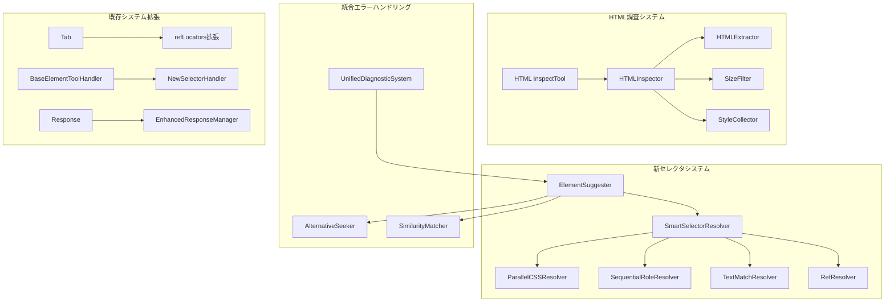
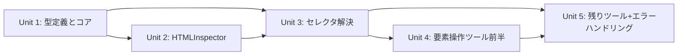

# HTML取得・拡張セレクタシステム 設計ドキュメント

## 1. 概要

### 1.1 背景
現在のfast-playwright-mcpは`element`と`ref`パラメータによる要素選択に制限されており、動的な要素選択やHTML構造の詳細調査が困難です。LLMがより柔軟にWebページと相互作用するためには、拡張されたセレクタシステムとHTML調査機能が必要です。

### 1.2 目的
- **統一されたセレクタシステム**: ref、role、CSS、テキストベースの要素選択を統合
- **HTML調査ツール**: 指定範囲のHTML構造を詳細に取得する機能
- **パフォーマンス最適化**: セレクタ解決の並列・順次戦略による高速化
- **エラーハンドリング向上**: 詳細なサジェスト機能と統合診断システム

### 1.3 スコープ

#### 含まれる機能
- 新しい統一セレクタシステム（ElementSelector型）
- HTML調査ツール（browser_inspect_html）
- 全7つのブラウザ操作ツールのAPI更新
- ハイブリッドスマート解決システム
- HTMLInspectorユーティリティ
- 統合エラーハンドリングとサジェスト機能

#### 含まれない機能  
- 既存API（element + refパラメータ）の後方互換性
- XPathセレクタサポート
- DOM操作機能
- ビジュアルセレクタ（座標ベース）

## 2. 要件

### 2.1 機能要件
- **FR-001**: 統一セレクタAPI - ref、role、CSS、テキストベースの選択をサポート
- **FR-002**: HTML調査ツール - 指定範囲のHTML構造を50KB制限内で取得
- **FR-003**: セレクタ解決最適化 - 3秒以内の解決時間保証
- **FR-004**: エラーサジェスト - 要素が見つからない場合の代替案提示
- **FR-005**: バッチ実行対応 - 複数セレクタの並列解決

### 2.2 非機能要件
- **NFR-001**: パフォーマンス - HTML取得50KB/3秒、セレクタ解決3秒以内
- **NFR-002**: セキュリティ - XSS防止、安全なHTML出力
- **NFR-003**: 拡張性 - 新しいセレクタタイプの追加容易性
- **NFR-004**: 一貫性 - 全ツールでの統一されたAPI体験

## 3. 技術設計

### 3.1 アーキテクチャ



### 3.2 データモデル

#### 3.2.1 統一セレクタ型定義
```typescript
// 新しい統一セレクタシステム
type ElementSelector = 
  | { ref: string }                           // 既存refシステム
  | { role: string; text?: string }          // ARIAロールベース
  | { css: string }                          // CSSセレクタ
  | { text: string; tag?: string }           // テキストマッチング

// セレクタ解決結果
interface SelectorResolution {
  locator: playwright.Locator;
  selector: ElementSelector;
  confidence: number;
  alternatives?: ElementSelector[];
  resolutionTime: number;
}

// HTML調査パラメータ
interface HTMLInspectionParams {
  selectors: ElementSelector[];       // 取得範囲の指定
  depth?: number;                    // 階層深度（デフォルト2）
  includeStyles?: boolean;           // スタイル情報（デフォルトfalse）
  maxSize?: number;                  // 最大サイズ（デフォルト50KB）
  format?: 'html' | 'aria' | 'text'; // 出力形式
}
```

#### 3.2.2 HTMLInspector出力形式
```typescript
interface HTMLInspectionResult {
  elements: {
    [selectorIndex: number]: {
      html: string;
      styles?: CSSStyleDeclaration;
      children?: HTMLInspectionResult;
      metadata: {
        tagName: string;
        attributes: Record<string, string>;
        textContent: string;
        size: number;
      };
    };
  };
  totalSize: number;
  truncated: boolean;
  suggestions?: string[];
}
```

### 3.3 セレクタ解決戦略

#### 3.3.1 ハイブリッドスマート解決システム
```typescript
class SmartSelectorResolver {
  async resolve(
    tab: Tab, 
    selectors: ElementSelector[]
  ): Promise<SelectorResolution[]> {
    // 1. セレクタタイプ別の分類
    const categorized = this.categorizeSelectors(selectors);
    
    // 2. 最適化された並列・順次実行
    const results = await Promise.allSettled([
      // ref解決（高速・優先）
      this.resolveRefs(tab, categorized.refs),
      // CSS解決（並列実行）
      this.resolveCSSSelectors(tab, categorized.css),
      // Role解決（順次実行）
      this.resolveRoleSelectors(tab, categorized.roles),
      // テキスト解決（最後、フォールバック）
      this.resolveTextSelectors(tab, categorized.text)
    ]);
    
    // 3. 結果の統合と信頼度スコア付与
    return this.consolidateResults(results);
  }
  
  private categorizeSelectors(selectors: ElementSelector[]) {
    return {
      refs: selectors.filter(s => 'ref' in s),
      css: selectors.filter(s => 'css' in s),
      roles: selectors.filter(s => 'role' in s),
      text: selectors.filter(s => 'text' in s && !('role' in s))
    };
  }
}
```

### 3.4 HTMLInspectorの実装

#### 3.4.1 階層的HTML抽出
```typescript
class HTMLInspector {
  async inspect(
    tab: Tab, 
    params: HTMLInspectionParams
  ): Promise<HTMLInspectionResult> {
    // 1. セレクタ解決
    const resolvedSelectors = await this.resolver.resolve(
      tab, 
      params.selectors
    );
    
    // 2. 階層的HTML抽出
    const elements = await Promise.all(
      resolvedSelectors.map(async (resolution, index) => {
        const element = await this.extractElementHierarchy(
          resolution.locator,
          params.depth ?? 2,
          params.includeStyles
        );
        return { [index]: element };
      })
    );
    
    // 3. サイズ制限とトランケート
    return this.applySize Limits(elements, params.maxSize ?? 50000);
  }
  
  private async extractElementHierarchy(
    locator: playwright.Locator,
    depth: number,
    includeStyles: boolean
  ) {
    const element = await locator.first();
    const html = await element.innerHTML();
    
    const result = {
      html: this.sanitizeHTML(html),
      metadata: await this.extractMetadata(element),
      ...(includeStyles && { 
        styles: await this.extractComputedStyles(element) 
      })
    };
    
    // 再帰的な子要素抽出（深度制限）
    if (depth > 0) {
      const children = await element.locator('> *').all();
      if (children.length > 0) {
        result.children = await this.extractChildren(
          children, 
          depth - 1, 
          includeStyles
        );
      }
    }
    
    return result;
  }
}
```

### 3.5 エラーハンドリングとサジェスト機能

#### 3.5.1 統合診断システムの拡張
```typescript
class EnhancedElementSuggester extends UnifiedDiagnosticSystem {
  async suggestAlternatives(
    tab: Tab,
    failedSelector: ElementSelector,
    context: 'not_found' | 'not_visible' | 'not_interactable'
  ): Promise<ElementSelector[]> {
    const snapshot = await tab.captureSnapshot();
    
    switch (context) {
      case 'not_found':
        return this.findSimilarElements(snapshot, failedSelector);
      case 'not_visible':
        return this.findVisibleAlternatives(snapshot, failedSelector);
      case 'not_interactable':
        return this.findInteractableAlternatives(snapshot, failedSelector);
    }
  }
  
  private async findSimilarElements(
    snapshot: TabSnapshot,
    selector: ElementSelector
  ): Promise<ElementSelector[]> {
    const suggestions: ElementSelector[] = [];
    
    if ('role' in selector) {
      // 類似ロールの検索
      suggestions.push(...this.findSimilarRoles(snapshot, selector.role));
      // テキストマッチングでの代替
      if (selector.text) {
        suggestions.push(...this.findByPartialText(snapshot, selector.text));
      }
    }
    
    if ('css' in selector) {
      // CSS階層の緩和
      suggestions.push(...this.relaxCSSSelector(selector.css));
    }
    
    if ('text' in selector) {
      // 部分マッチング、大文字小文字無視
      suggestions.push(...this.findByFuzzyText(snapshot, selector.text));
    }
    
    return suggestions.slice(0, 5); // 最大5つの提案
  }
}
```

## 4. 実装計画

### 4.1 実装単位の分割

実装を以下の単位に分割し、各単位ごとにvalidationを実施します：

#### Unit 1: 型定義とコア構造（推定: 400行）
- **対象ファイル**: 
  - `src/types/selectors.ts` (新規作成)
  - `src/tools/selector-resolver.ts` (新規作成) 
  - `src/tools/base-tool-handler.ts` (拡張)
- **実装内容**:
  - ElementSelector型定義とスキーマ
  - SmartSelectorResolverの基本構造
  - BaseElementToolHandlerの拡張（新セレクタ対応）
- **検証ポイント**:
  - TODO/FIXMEコメント: 0件
  - モック実装: 0件  
  - 空関数: 0件
  - ハードコード値: 0件
- **依存関係**: なし

#### Unit 2: HTMLInspectorとHTML調査ツール（推定: 450行）
- **対象ファイル**:
  - `src/tools/html-inspector.ts` (新規作成)
  - `src/tools/inspect-html.ts` (新規作成)
  - `src/utils/html-utils.ts` (新規作成)
- **実装内容**:
  - HTMLInspectorクラスの完全実装
  - browser_inspect_htmlツール
  - HTML sanitization とサイズ制限機能
  - 階層的抽出とスタイル収集
- **検証ポイント**:
  - TODO/FIXMEコメント: 0件
  - モック実装: 0件
  - 空関数: 0件
  - ハードコード値: 0件
- **依存関係**: Unit 1

#### Unit 3: セレクタ解決ロジック（推定: 500行）
- **対象ファイル**:
  - `src/tools/selector-resolver.ts` (拡張)
  - `src/tab.ts` (refLocators拡張)
  - `src/tools/selector-strategies.ts` (新規作成)
- **実装内容**:
  - 各セレクタタイプの解決戦略実装
  - Tab.refLocatorsの拡張（新セレクタ対応）
  - 並列・順次実行の最適化
  - 信頼度スコアリング
- **検証ポイント**:
  - TODO/FIXMEコメント: 0件
  - モック実装: 0件
  - 空関数: 0件
  - ハードコード値: 0件
- **依存関係**: Unit 1, Unit 2

#### Unit 4: 要素操作ツール更新（推定: 600行）
- **対象ファイル**:
  - `src/tools/snapshot.ts` (API更新)
  - `src/tools/keyboard.ts` (API更新)
  - `src/tools/screenshot.ts` (API更新)
  - `src/tools/evaluate.ts` (API更新)
- **実装内容**:
  - 4つの要素操作ツールの新セレクタAPI対応
  - 統一されたパラメータ検証
  - エラーハンドリングの改善
- **検証ポイント**:
  - TODO/FIXMEコメント: 0件
  - モック実装: 0件
  - 空関数: 0件
  - ハードコード値: 0件
- **依存関係**: Unit 1, Unit 3

#### Unit 5: 残りツール更新とエラーハンドリング（推定: 550行）
- **対象ファイル**:
  - `src/tools/mouse.ts` (API更新、座標系は維持)
  - `src/tools/files.ts` (API更新)
  - `src/tools/find-elements.ts` (新セレクタ統合)
  - `src/tools/enhanced-suggester.ts` (新規作成)
- **実装内容**:
  - 残り3つのツールの新セレクタAPI対応
  - find-elementsの新セレクタ統合
  - EnhancedElementSuggesterの実装
  - 統合診断システムの拡張
- **検証ポイント**:
  - TODO/FIXMEコメント: 0件
  - モック実装: 0件
  - 空関数: 0件
  - ハードコード値: 0件
- **依存関係**: Unit 1, Unit 3, Unit 4

### 4.2 実装順序と依存関係



### 4.3 各単位の完了基準
全ての実装単位は以下の基準を満たす必要があります：
- ✅ TODO/FIXMEコメント: 0件
- ✅ モック実装: 0件  
- ✅ 空関数・未実装: 0件
- ✅ ハードコード値: 0件
- ✅ 適切なエラーハンドリング
- ✅ TypeScript型安全性確保
- ✅ 既存テストの非破綻

### 4.4 PR分割計画

#### PR #1: コア型定義と基盤構造
- **ブランチ名**: `feature/unified-selector-types`
- **内容**:
  - ElementSelector型定義
  - SmartSelectorResolverの基本構造  
  - BaseElementToolHandlerの拡張
- **ファイル変更**:
  - `src/types/selectors.ts` (新規)
  - `src/tools/selector-resolver.ts` (新規)
  - `src/tools/base-tool-handler.ts` (拡張)
- **テスト**:
  - 型定義の単体テスト
  - セレクタスキーマ検証テスト
- **レビューポイント**:
  - 型安全性の確保
  - 拡張性の考慮
  - パフォーマンス設計の妥当性

#### PR #2: HTML調査システム
- **ブランチ名**: `feature/html-inspector-tool`  
- **依存**: PR #1
- **内容**:
  - HTMLInspectorの完全実装
  - browser_inspect_htmlツール
  - HTML処理ユーティリティ
- **ファイル変更**:
  - `src/tools/html-inspector.ts` (新規)
  - `src/tools/inspect-html.ts` (新規)
  - `src/utils/html-utils.ts` (新規)
- **テスト**:
  - HTMLInspectorの単体テスト
  - サイズ制限とトランケート機能
  - 階層抽出テスト
- **レビューポイント**:
  - パフォーマンス（50KB制限遵守）
  - セキュリティ（XSS防止）
  - エラーハンドリング

#### PR #3: セレクタ解決エンジン
- **ブランチ名**: `feature/smart-selector-resolution`
- **依存**: PR #1, PR #2
- **内容**:
  - セレクタ解決戦略の実装
  - Tab.refLocatorsの拡張
  - 並列・順次実行最適化
- **ファイル変更**:
  - `src/tools/selector-resolver.ts` (完成)
  - `src/tab.ts` (refLocators拡張)
  - `src/tools/selector-strategies.ts` (新規)
- **テスト**:
  - 各セレクタタイプの解決テスト
  - パフォーマンステスト（3秒制限）
  - 並列実行テスト
- **レビューポイント**:
  - パフォーマンス要件達成
  - 各セレクタタイプの正確性
  - エラー時のフォールバック

#### PR #4: 要素操作ツール更新（前半）
- **ブランチ名**: `feature/element-tools-api-update-1`
- **依存**: PR #3
- **内容**:
  - browser_click, browser_type, browser_hover, browser_screenshot
  - 統一セレクタAPIへの移行
- **ファイル変更**:
  - `src/tools/snapshot.ts` (API更新)
  - `src/tools/keyboard.ts` (API更新)  
  - `src/tools/screenshot.ts` (API更新)
  - `src/tools/evaluate.ts` (API更新)
- **テスト**:
  - 新API統合テスト
  - 既存機能の回帰テスト
- **レビューポイント**:
  - API一貫性
  - 破壊的変更の影響確認
  - バッチ実行との互換性

#### PR #5: 残りツール更新と完成
- **ブランチ名**: `feature/element-tools-api-update-2`  
- **依存**: PR #4
- **内容**:
  - 残りツールのAPI更新
  - エラーハンドリング強化
  - ドキュメント更新
- **ファイル変更**:
  - `src/tools/mouse.ts` (部分更新)
  - `src/tools/files.ts` (API更新)
  - `src/tools/find-elements.ts` (統合)
  - `src/tools/enhanced-suggester.ts` (新規)
  - `README.md` (更新)
- **テスト**:
  - 総合E2Eテスト
  - パフォーマンステスト
  - エラーケーステスト
- **レビューポイント**:
  - システム全体の整合性
  - パフォーマンス要件達成
  - エラーハンドリングの妥当性

### 4.5 実装手順詳細

#### ステップ1: Unit 1の実装
1. **ElementSelector型定義**:
   ```typescript
   // src/types/selectors.ts
   export type ElementSelector = 
     | { ref: string }
     | { role: string; text?: string }  
     | { css: string }
     | { text: string; tag?: string };
   ```

2. **SmartSelectorResolverの基本構造**:
   - インターフェース定義
   - 基本的な解決ロジックの骨格
   - エラーハンドリングの基盤

3. **BaseElementToolHandlerの拡張**:
   - 新セレクタ対応メソッドの追加
   - 既存functionalityの保持

**注意点**:
- 実装内容は完全で実用的である必要がある
- TODOコメントやモックは一切使用しない
- TypeScript型安全性を完全に確保する

#### ステップ2: Unit 1の検証
- Unit 1の実装内容をvalidation
- 問題があれば修正して再検証
- PASSしたら次のUnitへ進行

#### ステップ3-10: 残りUnit実装
各Unitについて実装→検証のサイクルを繰り返す

### 4.6 推定実装時間
- Unit 1: 8時間（型定義と基盤）
- Unit 2: 10時間（HTMLInspector）  
- Unit 3: 12時間（セレクタ解決）
- Unit 4: 14時間（要素操作ツール前半）
- Unit 5: 12時間（残りツール+エラーハンドリング）
- 各Unitの検証: 30分程度
- 統合・調整: 4時間
- **合計: 約62時間（4-5週間）**

## 5. テスト計画

### 5.1 単体テスト
- **カバレッジ目標**: 90%以上
- **重点テスト項目**:
  - セレクタ解決の正確性
  - HTMLInspectorのサイズ制限
  - エラーハンドリングとサジェスト機能
  - 各セレクタタイプの個別動作

### 5.2 統合テスト
- **セレクタ解決統合テスト**: 複数セレクタタイプの組み合わせ
- **ツール間相互作用テスト**: batch_executeでの新セレクタ使用
- **パフォーマンステスト**: 制限時間内での実行確認

### 5.3 E2Eテスト
- **実際のWebページでの動作確認**
- **複雑なDOM構造での解決テスト**  
- **エラー状況でのサジェスト機能確認**
- **HTMLInspector出力品質検証**

## 6. リスクと対策

### 6.1 技術的リスク

| リスク | 影響度 | 発生確率 | 対策 |
|--------|--------|----------|------|
| セレクタ解決パフォーマンス劣化 | 高 | 中 | 並列処理最適化、キャッシュ機構導入 |
| HTMLサイズ制限での情報損失 | 中 | 高 | 賢いトランケート、優先度ベース抽出 |
| 複雑DOMでの解決失敗 | 中 | 中 | フォールバック戦略、代替提案機能 |
| メモリ使用量増加 | 中 | 中 | ストリーミング処理、適切なクリーンアップ |
| TypeScript型推論の複雑化 | 低 | 中 | シンプルな型設計、適切なユニオン型使用 |

### 6.2 スケジュールリスク
- **Unit間の依存関係による遅延**: 並列実装可能な部分の識別、事前準備
- **予想より複雑な実装**: バッファ時間の確保、段階的品質向上
- **テスト期間の不足**: テスト駆動開発、継続的な品質確認

## 7. 運用考慮事項

### 7.1 監視項目
- **セレクタ解決時間**: 平均解決時間、95パーセンタイル
- **HTML取得サイズ**: 平均サイズ、制限超過率
- **エラー率**: セレクタタイプ別の失敗率
- **サジェスト精度**: 提案された代替案の有効性

### 7.2 ロールバック計画
- **段階的無効化**: 新機能のフィーチャーフラグ
- **互換性レイヤー**: 一時的な旧API サポート
- **データベース変更**: 不要（設定ファイルのみ）

## 8. 意思決定の記録

### 決定事項1: ハイブリッド解決方式の採用
- **選択肢**:
  - A: 統一された単一解決エンジン
  - B: セレクタタイプ別の最適化エンジン（ハイブリッド）
- **決定**: B
- **理由**: 
  - セレクタタイプによってパフォーマンス特性が大きく異なる
  - ref解決は既存の高速な仕組みを活用
  - CSS解決は並列化による高速化が可能
  - テキスト解決は順次実行でフォールバック戦略が重要

### 決定事項2: 破壊的変更アプローチの採用
- **選択肢**:
  - A: 後方互換性を保つ段階的移行
  - B: 完全刷新による破壊的変更
- **決定**: B  
- **理由**:
  - element + ref パラメータ構造の根本的な制約
  - 統一API による開発体験向上
  - 中途半端な互換性レイヤーによる複雑性回避
  - プロジェクト規模での実装・テスト工数削減

### 決定事項3: HTMLInspectorの最大サイズ制限
- **選択肢**:
  - A: 制限なし（ユーザー責任）
  - B: 50KB制限（デフォルト、調整可能）
  - C: 動的制限（コンテンツによる適応）
- **決定**: B
- **理由**:
  - LLMトークン制限との整合性
  - 予測可能なパフォーマンス特性
  - 実装の単純性

## 9. 更新履歴

| 日付 | 更新者 | 内容 |
|------|--------|------|
| 2025-09-05 | design-docs-creator | 初版作成、実装計画詳細化 |

## 10. 承認

**この設計で進めてよろしいでしょうか？**

この設計ドキュメントは以下の主要要素を含んでいます：

### 🔑 重要な設計決定
- **ハイブリッドスマート解決方式**: セレクタタイプ別の最適化による高速化
- **完全刷新アプローチ**: 破壊的変更による統一API実現  
- **階層的HTML抽出**: 50KB制限内での効率的な情報収集
- **統合エラーハンドリング**: 詳細なサジェスト機能

### 📋 実装準備度
- **5つのUnit分割**: 各300-600行の実装可能なユニット
- **依存関係の明確化**: 並列・順次実装の最適化
- **完了基準の定義**: TODO/モック実装禁止の厳格な品質管理
- **PR戦略**: 段階的レビューと統合リスク軽減

### ⚡ パフォーマンス要件
- **セレクタ解決**: 3秒以内の保証
- **HTML取得**: 50KB制限での高品質抽出
- **並列最適化**: セレクタタイプ別の効率化

承認後、実装フェーズに移行します。